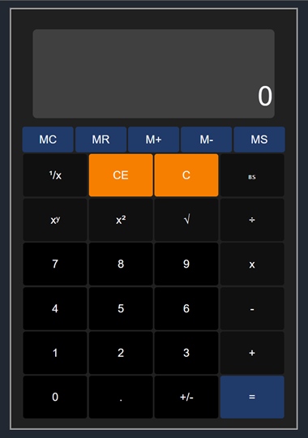

# Calculator App

Calculator application built with HTML, CSS, and JavaScript
  
View it [here](https://jhirschfelder.github.io/Calculator-app/)

This project was a great growing experience. I got alot of practice with switches and delved into adding LocalStorage and an app state variable to control behavior. 
